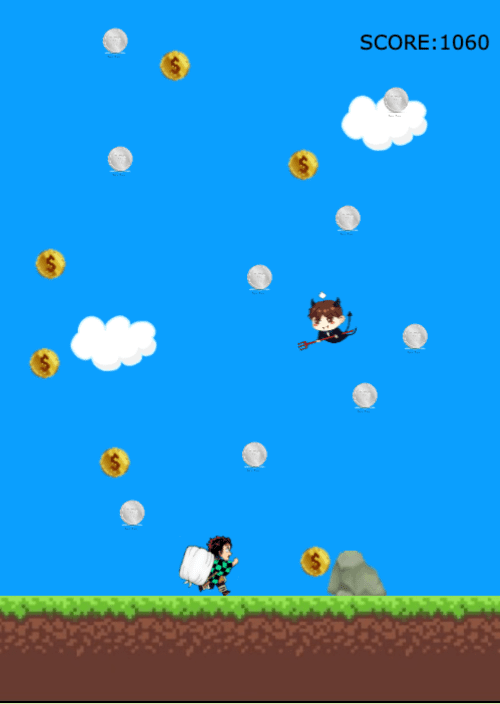

# Coin-collector

Coin-Collector is a game about collectiong two types of coins which falling from top to bottom.
There are two things the player need to be careful. One is devils and the other is rocks. When you can't avoid the rock,
you are automatically GAME OVER.

The game score is calculated how many coins you got and how many times hit the devils.
The gold coin is +50 points, the silver coins is +30 points and when you hit the devils, you lose -10 points.

## MVP (DOM - CANVAS)
  - There are two types of coins.
  - Player can move and jump.
  - There are two enemies to disturb your score.
  - When you hit the rock enemiy, the game is over.
  - Compete final score.

### How to play
Use the arrow key to move right forward, left forward and jump.

## Data structure

### script.js
    - draw()
    - initial()
    - resetGame()

### base.js
    - hideMain()
    - showGame()
    - showGameover()
    - startGame()
    - restartGame()

## States y States Transitions
- splashScreen
- gameScreen
- gameoverScreen 

Developed this game during a first project week at a coding bootcamp Ironhack.
[Link to the game](https://megumikawa.github.io/coin-collector-game/)

### Git
[Repo](https://github.com/Megumikawa/coin-collector-game)

### Slides
[Presentation slides](https://docs.google.com/presentation/d/1-JP6aUQVnvrFvNxNDEE-PcuwlrV2vP0SGwoEcGru8Oo/edit?usp=sharing)

